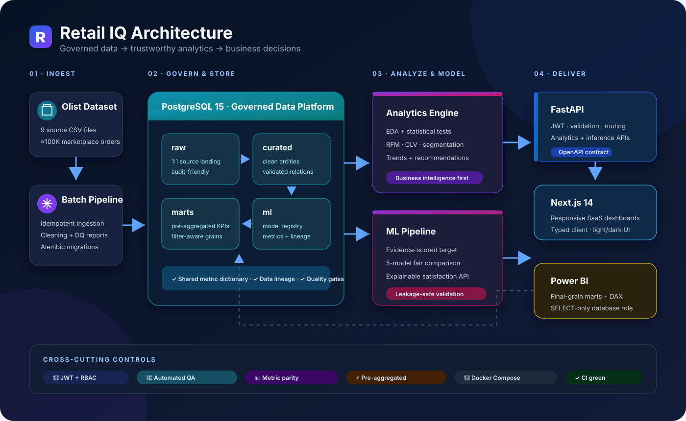
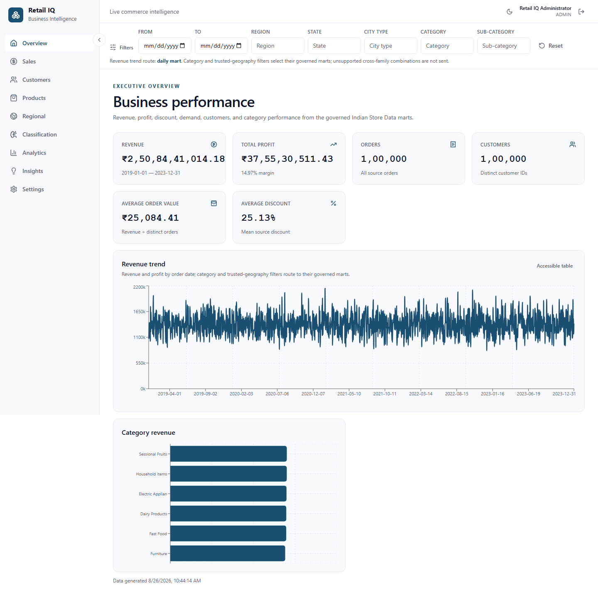
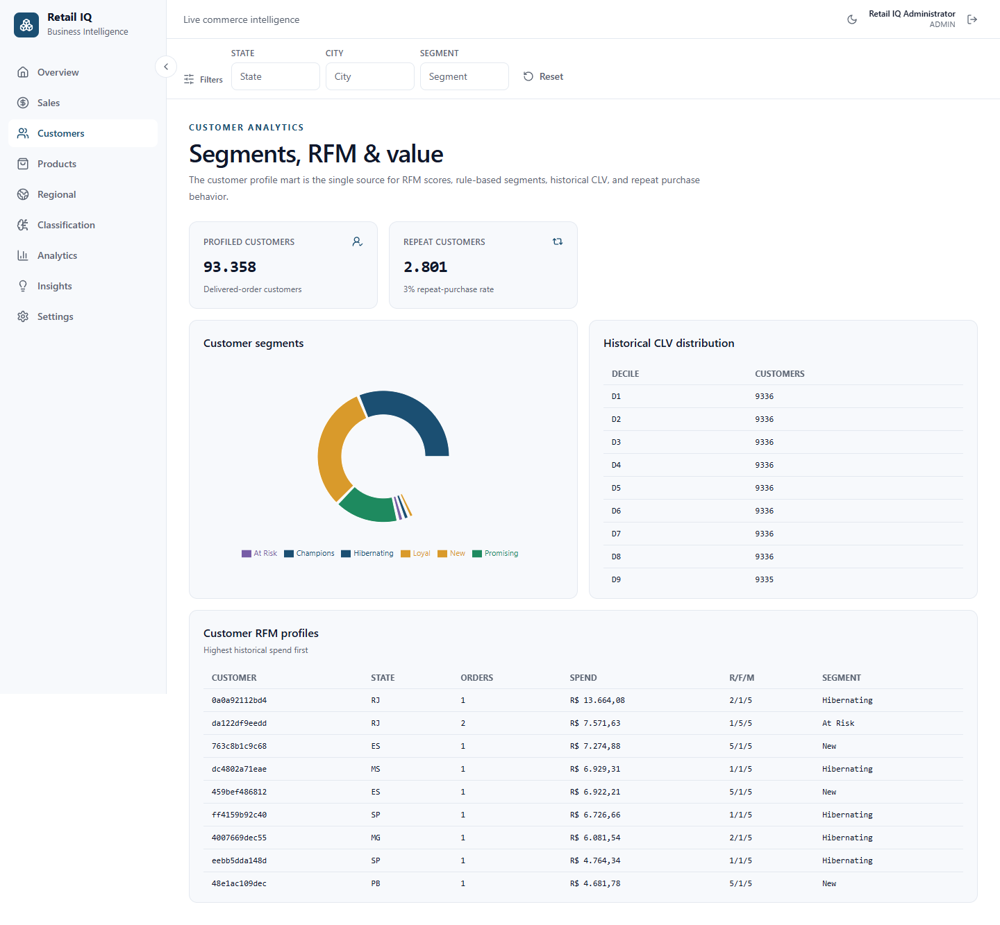
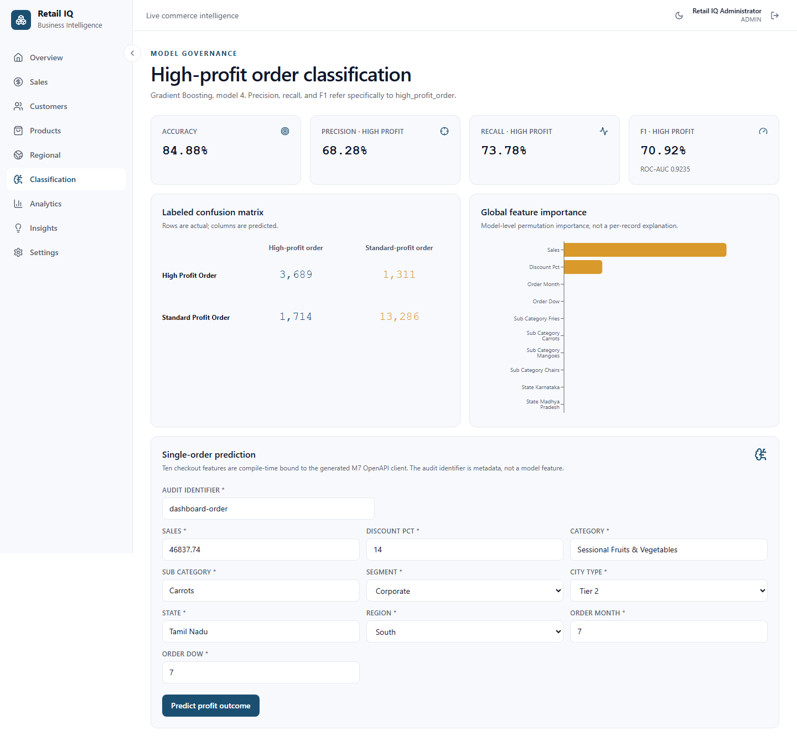
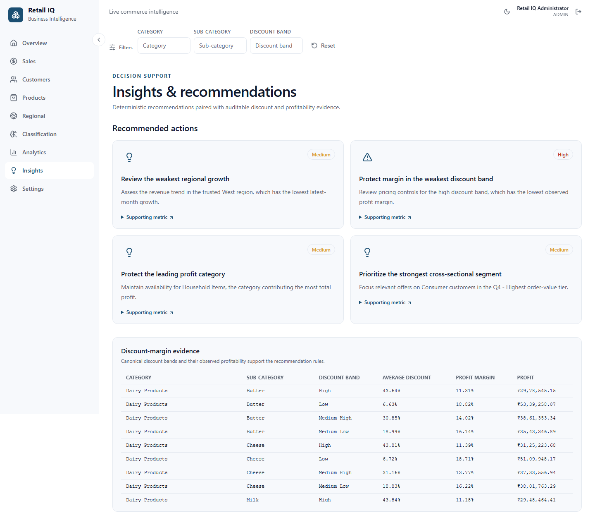

# Retail IQ — Retail Business Intelligence Platform

[](https://github.com/ParthrChandurkar/Retail-IQ/actions/workflows/ci.yml)


An analytics-first retail decision-support platform combining governed ETL,
statistical analysis, interactive SaaS dashboards, customer analytics, and an
explainable satisfaction classifier over the Brazilian Olist marketplace.

> **From nine raw commerce files to governed KPIs, customer intelligence,
> explainable predictions, and decision-ready dashboards.**

## 🎯 Problem Statement

Retail datasets contain orders, customers, products, sellers, payments,
delivery events, and reviews at different grains. Retail IQ turns those files
into consistent business metrics and decision support without treating machine
learning as the whole product. The platform prioritizes data quality, BI,
exploratory and statistical analysis, RFM/CLV, interactive filtering, and
auditable recommendations; ML supports that analytics foundation.

## 🗂️ Dataset

The project uses the
[Olist Brazilian E-Commerce Public Dataset](https://www.kaggle.com/datasets/olistbr/brazilian-ecommerce):
nine CSV files covering approximately 100,000 marketplace orders from 2016–2018.
Raw CSVs are not committed. Follow the acquisition contract in
[`data/README.md`](data/README.md).

Revenue, orders, customers, AOV, and historical CLV include delivered orders
only. Revenue equals item price plus freight, and purchase timestamp is the
primary date axis.

## 🏗️ Architecture



| Flow | What happens |
|---|---|
| **1 · Ingest** | Nine Olist CSVs enter an idempotent, quality-reported batch pipeline. |
| **2 · Govern** | PostgreSQL separates source landing (`raw`), clean entities (`curated`), aggregates (`marts`), and model governance (`ml`). |
| **3 · Analyze** | EDA, statistics, RFM, CLV, segmentation, recommendations, and leakage-safe model training share governed definitions. |
| **4 · Deliver** | FastAPI serves the typed Next.js dashboards; Power BI receives SELECT-only access to finalized marts. |

Next.js consumes FastAPI through an OpenAPI-generated typed client. FastAPI
owns JWT authentication, validation, mart routing, analytics, recommendations,
and inference. PostgreSQL separates ingestion, clean entities, dashboard marts,
and model governance. Batch jobs populate the same marts consumed by the web
dashboard and the least-privilege Power BI connection. See
[`docs/architecture.md`](docs/architecture.md) for request flows, batch flows,
deployment topology, and trust boundaries.

## 🧰 Tech Stack

| Layer | Technology |
|---|---|
| Frontend | Next.js 14, React 18, TypeScript, Tailwind CSS, React Query, Zustand, Recharts, Leaflet, Framer Motion |
| Backend | Python 3.11, FastAPI, Pydantic 2, SQLAlchemy 2, asyncpg, Alembic |
| Analytics | pandas, SciPy, scikit-learn, Matplotlib, Seaborn, Jupyter |
| ML | Logistic Regression, Decision Tree, Random Forest, Gradient Boosting, XGBoost, joblib registry |
| Data | PostgreSQL 15; `raw`, `curated`, `marts`, and `ml` schemas |
| Delivery & QA | Docker Compose, Make, GitHub Actions, pytest, Ruff, mypy, Vitest/RTL, Playwright, axe-core |
| BI | Power BI Desktop through read-only PostgreSQL marts and governed DAX |

## 🚀 Installation

Prerequisites: Git, Docker Desktop with the Linux engine running, GNU Make,
and either Kaggle credentials or the manually downloaded dataset. Node.js 20+
is needed only for local frontend development/tests outside Docker. Power BI
Desktop is optional for the web app but required to build/view the Power BI
report locally.

This is the complete documented clean-clone sequence from Addendum §12:

1. **Clone the repository:**

   ```bash
   git clone https://github.com/ParthrChandurkar/Retail-IQ.git
   cd Retail-IQ
   ```

2. **Create local environment files:**

   ```bash
   cp backend/.env.example backend/.env
   cp frontend/.env.example frontend/.env
   ```

   Windows PowerShell equivalents are `Copy-Item backend/.env.example
   backend/.env` and `Copy-Item frontend/.env.example frontend/.env`.

   Before continuing, edit `backend/.env` and replace at least
   `JWT_SECRET`, `ADMIN_EMAIL`, `ADMIN_PASSWORD`, and
   `POWERBI_READER_PASSWORD`. Use a valid email and strong unique secrets.
   These values create the first administrator and the Power BI database login;
   they are never committed.

3. **Download all nine CSVs using one option:**

   - Manual: download the
     [Kaggle archive](https://www.kaggle.com/datasets/olistbr/brazilian-ecommerce)
     and place its nine CSV files directly in `data/raw/`.
   - Automated: export `KAGGLE_USERNAME` and `KAGGLE_KEY` in the current shell,
     then run:

     ```bash
     make download-data
     ```

4. **Start PostgreSQL, FastAPI, and Next.js:**

   ```bash
   docker compose up -d
   ```

5. **Ingest and clean the dataset:**

   ```bash
   make etl
   ```

6. **Build marts and generate EDA/statistics reports:**

   ```bash
   make analytics-reports
   ```

7. **Train, compare, select, and register the classifier:**

   ```bash
   make train
   ```

8. **Open <http://localhost:3000>** and sign in with the `ADMIN_EMAIL` and
   `ADMIN_PASSWORD` configured in step 2.

The full workflow is intentionally batch-oriented and model training can take
several minutes. Check service health with `docker compose ps`; stop everything
with `make down`. There are no additional undocumented setup steps.

## 🧭 Usage

- Sign in at <http://localhost:3000/login>. Access tokens stay in memory; the
  rotating refresh token is an httpOnly cookie.
- Use the shared filter bar and sidebar to explore Executive, Sales, Customers,
  Products, Regional, Classification, Analytics, Insights, and Settings pages.
- On Classification, enter one record matching the live feature form. The shown
  probability is confidence in the returned `low_satisfaction` or
  `high_satisfaction` outcome.
- API Swagger documentation is at <http://localhost:8000/docs>; health is at
  <http://localhost:8000/health>.
- Run `make test` for backend quality/tests and frontend lint/type/unit tests.
- Connect Power BI using [`docs/powerbi-integration.md`](docs/powerbi-integration.md).

## 📁 Folder Structure

```text
Retail-IQ/
├── frontend/               # Next.js UI, generated API client, Vitest/Playwright
├── backend/
│   ├── app/                # API, ETL, analytics services, auth, ML
│   ├── alembic/            # schema, mart, Power BI, and performance migrations
│   ├── ml/registry/        # local joblib artifacts (ignored)
│   └── tests/
├── analytics/
│   ├── notebooks/          # executable EDA/statistics notebooks
│   └── reports/            # quality, EDA, statistics, target, model, NLP reports
├── data/raw/               # nine local source CSVs (ignored)
├── docs/                   # SRS, architecture, routing, QA, screenshots, Power BI
├── powerbi/                # governed DAX measure library
├── .github/workflows/ci.yml
├── docker-compose.yml
└── Makefile
```

## ✨ Features

- [x] Idempotent nine-file ingestion, cleaned curated entities, outlier flags,
  and generated pre/post data-quality reports.
- [x] Delivered-order KPI dictionary shared by marts, API, web dashboards, and
  Power BI measures.
- [x] JWT login, rotating refresh, administrator bootstrap, protected APIs, and
  least-privilege authorization.
- [x] Executive, sales, customer, product, seller, regional, payment, review,
  analytics, classification, insights/recommendations, and settings APIs.
- [x] Responsive light/dark SaaS dashboards with governed filters, charts,
  accessible tables, maps, keyboard navigation, and real backend data.
- [x] EDA plus descriptive statistics, correlation/covariance, Chi-Square,
  ANOVA, and T-Test with plain-language conclusions.
- [x] Customer RFM, rule-based segmentation, repeat purchase, and historical
  lifetime value to date.
- [x] Evidence-scored target selection before modeling, with leakage exclusions
  and a group-aware validation strategy.
- [x] Fair five-model comparison, positive-class evaluation, labeled confusion
  matrix, global feature importance, registered artifact, and live inference.
- [x] NLP feasibility gate with an explicit no-go; review distribution/trends
  remain available without fabricated sentiment/topics.
- [x] Deterministic, auditable business recommendations.
- [x] Power BI integration: marts-only PostgreSQL role, final-grain relationship
  guide, KPI-reconciled DAX measure library, and refresh instructions.
- [x] CI-enforced lint, type-check, unit/integration/e2e, accessibility,
  production build, and Docker-image verification.

## 🖼️ Screenshots

These PNGs were captured from the populated local application in a real Chromium
browser during Phase 9.

### 📈 Executive dashboard



### 👥 Customer analytics



### 🧠 Satisfaction classification



### 💡 Insights and recommendations



## 🧪 Target Variable Selection Summary

Retail IQ did not assume a label. It scored four candidates from real EDA and
statistics using the SRS rubric:

| Candidate | Score | Key observed constraint |
|---|---:|---|
| Repeat customer | 14/25 | only 3.0003% repeat customers |
| Customer satisfaction | **24/25** | 99.3304% coverage; 21.0749% low satisfaction |
| Late delivery | 19/25 | 8.1124% late; weaker pre-outcome signals |
| High-value customer | 21/25 | useful balance but temporal/leakage complexity |

The selected target is **Customer Satisfaction**: `low_satisfaction` for review
score ≤3 versus `high_satisfaction` for score ≥4. The business-positive class is
`low_satisfaction`. The model uses a seed-42, group-aware stratified 80/20 split
by order and excludes every review-derived outcome field. This evidence-first
gate is documented in
[`target_variable_selection.md`](analytics/reports/target_variable_selection.md).

## 🔭 Future Scope

- Multi-tenant organizations, row-level access policies, and self-service users.
- Streaming/CDC ingestion and scheduled orchestration rather than local batch
  commands.
- Managed cloud PostgreSQL, container hosting, secrets management, CDN,
  centralized observability, backups, and TLS termination.
- SHAP local explanations; current explainability is governed global feature
  importance.
- Revisit Portuguese NLP only with improved comment coverage/length; the current
  evidence gate returned no-go.
- Author and publish a branded `.pbix`/`.pbit` through Power BI Desktop/Service;
  no Microsoft credential or unverifiable binary is committed here.
- Upgrade the SRS-pinned Next.js 14 stack in a governed compatibility cycle to
  address upstream advisories that require a breaking major upgrade.

The Phase 8 KPI-paint gap was a fixed synchronization defect, not an unresolved
device inefficiency: supporting charts now load progressively, and measured
desktop/tablet/mobile warm KPI paints are all below 1.5 seconds.

## 🎓 License / Academic Note

Retail IQ is a final-year B.Tech Data Science & Analytics academic project built
with production-grade engineering practices. The Olist dataset remains governed
by its source license and is not redistributed. Unless a separate repository
license is added, source availability does not grant additional reuse rights.
