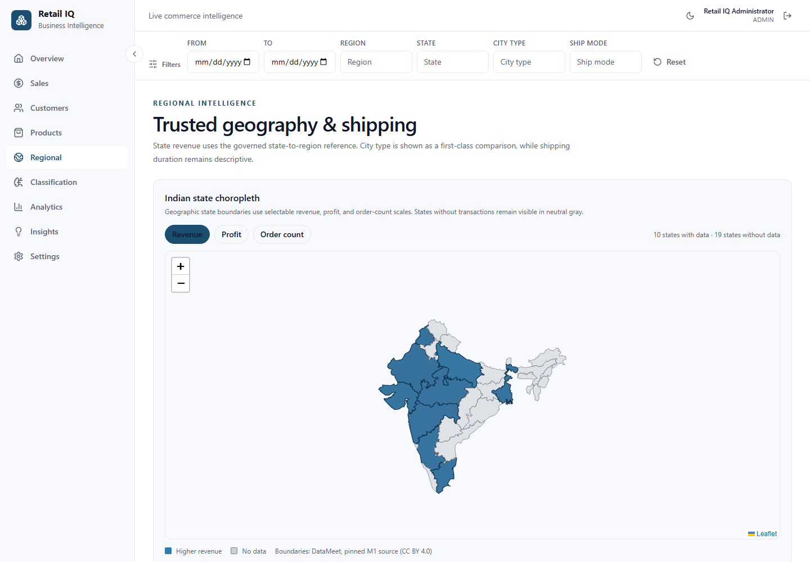
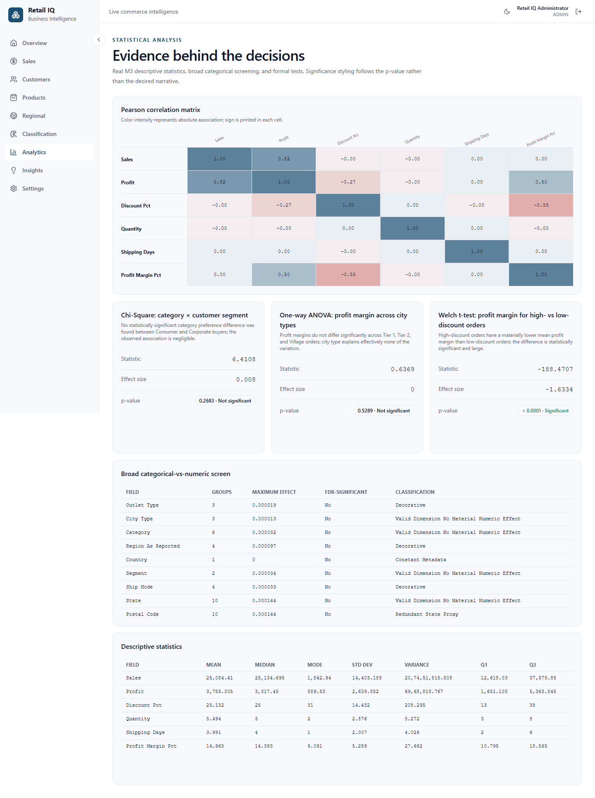

# 🛍️ Retail IQ — Indian Retail Business Intelligence Platform

> From one Indian retail transaction dataset to clean data, governed KPIs,
> statistical evidence, interactive dashboards, recommendations, and an
> explainable High-Profit Order prediction model.

## 📌 Project at a Glance

| Item | Details |
|---|---|
| **Project type** | Final-year B.Tech Data Science & Analytics project |
| **Focus** | Business Intelligence first; ML supports decisions |
| **Dataset** | Indian Store Data — 100,000 retail transactions |
| **Time range** | 1 January 2019 to 31 December 2023 |
| **Web stack** | Next.js + FastAPI + PostgreSQL + Docker |
| **Prediction task** | High-Profit Order Classification |
| **Active model** | Gradient Boosting |
| **BI delivery** | Web dashboards and Power BI from the same marts |

### 🗣️ Explain the project in one minute

Retail IQ is an analytics-first retail intelligence platform. It takes a
100,000-row Indian Store Data CSV, cleans and validates it, builds
dashboard-ready PostgreSQL marts, produces EDA and statistical evidence, and
trains a leakage-safe model that identifies likely high-profit orders. The same
governed data marts feed the Next.js dashboard and Power BI, so KPI numbers
remain consistent across both.

## 💼 Business Problem

Retail reports often contain disconnected charts, inconsistent totals, and
claims that the data cannot support. Retail IQ establishes one repeatable,
auditable decision-support workflow:

~~~text
Dataset understanding → cleaning → integration → EDA → statistics
→ feature engineering → target selection → ML → dashboards → recommendations
~~~

Analytics is the main product. Machine learning is included only for a business
problem the data can genuinely support.

## 🇮🇳 Indian Dataset

Retail IQ uses the [Indian Store Data dataset](https://www.kaggle.com/datasets/abuhumzakhan/store-data).

| Verified source fact | Value |
|---|---:|
| Data rows | 100,000 |
| Source columns | 25 |
| Distinct Order IDs | 100,000 |
| Distinct Customer IDs | 100,000 |
| Distinct Product IDs | 100,000 |
| Order-date range | 2019-01-01 → 2023-12-31 |
| Canonical local file | data/raw/indian_store_data.csv |

### 🔎 Important findings that shape the project

- Each customer and product appears once. Therefore RFM, repeat-customer
  prediction, customer lifetime value, and individual-product repeat-sales
  claims would be misleading.
- Customer analytics is deliberately cross-sectional: Segment × Order Value Tier
  × City Type.
- Product analytics is deliberately Category/Sub-Category based.
- The raw Region field is not trustworthy geography. Retail IQ retains it for
  audit only and uses a trusted state-to-region reference for maps and regional
  reporting.
- Legitimate extreme values are flagged rather than silently removed.

This Indian source supersedes the earlier Brazilian Olist implementation. Olist
reports are preserved only as clearly labelled historical records; no active
dashboard, API, model, or mart uses them.

## 🏗️ System Architecture

~~~text
Indian Store CSV
      ↓
Raw ingestion + pre-clean quality report
      ↓
Cleaning, validation, trusted geography, feature engineering
      ↓
Curated retail entities + audit logs
      ↓
Dashboard marts + EDA/statistics + ML registry
      ↓
FastAPI: auth, validation, routing, inference
      ↓                         ↓
Next.js dashboards         Power BI Desktop
~~~

Read [docs/architecture.md](docs/architecture.md) for the entity model, mart
grains, trust boundaries, and deployment design.

## ✨ What the Platform Delivers

### 📊 Dashboards

- **Executive Dashboard** — Revenue, Profit, Orders, Customers, AOV, Average
  Discount, trend, and category performance.
- **Sales Dashboard** — five-year revenue, profit, and demand trends.
- **Customer Dashboard** — Segment × Order Value Tier × City Type comparisons.
- **Product Dashboard** — Category/Sub-Category performance and
  Discount-versus-Profit analysis.
- **Regional Dashboard** — trusted Indian state choropleth, regional revenue,
  city-type comparison, and descriptive shipping performance.
- **Analytics Dashboard** — correlation, descriptive statistics, broad
  categorical screening, Chi-Square, ANOVA, T-Test, and seasonality.
- **Classification Dashboard** — model metrics, confusion matrix, feature
  importance, and single-order prediction.
- **Insights Dashboard** — deterministic recommendations backed by live marts.

### 📐 Governed analytics

- One metric dictionary for **Revenue**, **Profit**, **Profit Margin**, **AOV**,
  **Average Discount**, orders, and customers.
- Idempotent CSV ingestion with pre-clean and post-clean quality reports.
- Eight pre-aggregated PostgreSQL marts for fast, filter-safe dashboards.
- EDA, covariance/correlation, Chi-Square, ANOVA, T-Test, and five-year
  seasonality with plain-language conclusions.
- Honest findings: City Type does **not** materially explain profit margin
  (p=0.5289), while discount level has a significant relationship with margin.

### 🔐 Production-quality foundations

- JWT access tokens in memory and secure rotating refresh cookies.
- Validated request bodies, parameterized SQL, protected APIs, and Alembic
  migrations.
- The Power BI reader can query only dashboard marts, never raw, curated, or ML
  schemas.
- CI covers linting, typing, tests, accessibility, E2E flows, and Docker builds.

## 🤖 ML Decision

The target was selected only after data verification, EDA, statistics, and
feature engineering.

| Candidate | Score | Decision |
|---|---:|---|
| **High-Profit Order Classification** | **24/25** | ✅ Selected |
| Customer Segment Classification | 17/25 | Not selected |
| High-Discount / Margin-Erosion Classification | 16/25 | Not selected |

### Selected target

| Item | Definition |
|---|---|
| Positive label | high_profit_order |
| Negative label | standard_profit_order |
| Threshold | Profit ≥ ₹5,363.845, the fixed P75 threshold |
| Class balance | 25,000 high-profit / 75,000 standard-profit orders |
| Prediction point | Checkout |
| Validation | Stratified 80/20 order-level split, random seed 42 |
| Winning model | Gradient Boosting |
| Positive-class F1 | 0.709218 |
| ROC-AUC | 0.923453 |

The model uses ten checkout-safe inputs: Sales, Discount %, Category,
Sub-Category, Segment, City Type, State, trusted Region, Order Month, and
Order Day of Week. Profit, margin, future shipping fields, IDs, names, and
decorative source fields are excluded to prevent leakage.

The checked project database contains the active model as model_id 4. A fresh
local database assigns its own numeric ID when the same governed training job
registers the model; use the active-model API result rather than assuming a
specific ID after a clean setup.

Full evidence:
[target selection](analytics/reports/target_variable_selection_v2.md) ·
[model comparison](analytics/reports/model_comparison_v2.md)

## 🧰 Technology Stack

| Layer | Tools |
|---|---|
| Frontend | Next.js 14, React 18, TypeScript, Tailwind, React Query, Recharts, React Leaflet |
| Backend | Python 3.11, FastAPI, Pydantic, SQLAlchemy, asyncpg |
| Database | PostgreSQL 15 and Alembic |
| Analytics | pandas, SciPy, Matplotlib, Seaborn, Jupyter |
| ML | scikit-learn, XGBoost, joblib |
| Quality | pytest, Ruff, mypy, Vitest, RTL, Playwright, axe-core |
| Delivery | Docker Compose and GitHub Actions |
| BI | Power BI Desktop and governed DAX |

## 📁 Repository Guide

This is the map to use when explaining the project to another person.

~~~text
Retail-IQ/
├── frontend/                       Next.js dashboard application
│   ├── app/                        Login and all dashboard pages
│   ├── components/                 Reusable charts, filters, map, KPI, UI, prediction form
│   ├── lib/                        API runtime, formatters, client filter state
│   ├── src/generated/api/          Typed OpenAPI client generated from FastAPI
│   ├── tests/                      Unit/component and Playwright E2E tests
│   └── public/maps/                Indian-state GeoJSON for the choropleth
├── backend/                        FastAPI, data engineering, analytics, and ML
│   ├── app/main.py                 API application entry point
│   ├── app/routers/                Auth, dashboard, customer, product, region, analytics,
│   │                               classification, recommendation, and admin endpoints
│   ├── app/etl/                    Download, ingestion, cleaning, quality, feature, mart jobs
│   ├── app/services/               KPI, routing, statistics, recommendation, inference logic
│   ├── app/ml/                     Feature building, training, evaluation, explainability, registry
│   ├── app/models/                 SQLAlchemy database models
│   ├── app/schemas/                Request/response validation contracts
│   ├── alembic/                    Versioned PostgreSQL migrations
│   ├── tests/                      Backend, API, statistics, ML, and security tests
│   └── .env.example                Required backend settings and safe placeholders
├── analytics/
│   ├── notebooks/                  Executable EDA and statistics notebooks
│   └── reports/                    Quality, EDA, statistics, target-selection, and ML reports
├── data/
│   ├── raw/                        Ignored source location: indian_store_data.csv
│   └── README.md                   Acquisition, filename, checksum, and ETL instructions
├── docs/
│   ├── architecture.md             Data model, mart grains, security, deployment
│   ├── powerbi-integration.md      Power BI connection, relationships, DAX, reconciliation
│   ├── mart-routing.md             Which mart serves which filter combination
│   ├── qa-checklist.md             Test, security, performance, and clean-run proof
│   ├── screenshots/                Real rendered dashboard screenshots
│   └── SRS*.md                     Governing SRS and migration addenda
├── powerbi/
│   ├── RetailIQ-Measures.dax       Copy-paste-ready governed DAX measure library
│   └── README.md                   Power BI asset guide
├── docker-compose.yml              Starts PostgreSQL, FastAPI, and Next.js
├── Makefile                        Download, ETL, reports, training, and test commands
└── .github/workflows/ci.yml        Backend, frontend, and Docker CI checks
~~~

## 🚀 Run Locally

### 1. Prerequisites

- Git
- Docker Desktop with its Linux engine running
- 8 GB available RAM recommended for Docker and ML training
- GNU Make, **or** the Windows PowerShell commands shown below
- Kaggle credentials only for automated dataset download
- Power BI Desktop only for creating/viewing a Power BI report

### 2. Clone and configure

~~~bash
git clone https://github.com/ParthrChandurkar/Retail-IQ.git
cd Retail-IQ
~~~

~~~powershell
Copy-Item backend/.env.example backend/.env
Copy-Item frontend/.env.example frontend/.env
~~~

Set strong local values in backend/.env:

~~~dotenv
JWT_SECRET=replace-with-a-long-random-secret
ADMIN_EMAIL=your-valid-email@example.com
ADMIN_PASSWORD=replace-with-a-strong-password
POWERBI_READER_PASSWORD=replace-with-a-separate-strong-password
~~~

Never commit .env files or passwords.

### 3. Add the Indian dataset

Choose **one** path.

**Manual path**

1. Download [Indian Store Data](https://www.kaggle.com/datasets/abuhumzakhan/store-data).
2. Extract store_sales_data (2).csv.
3. Rename it to indian_store_data.csv.
4. Place it at data/raw/indian_store_data.csv.

**Automated Kaggle path**

~~~powershell
$env:KAGGLE_USERNAME = "your-kaggle-username"
$env:KAGGLE_KEY = "your-kaggle-api-key"
make download-data
~~~

The expected file has 100,000 data rows and SHA-256:

~~~text
df1dd4a0d6bd486d34499e87b249e875f2a03bc407f5ffdddddf34bea80e727e
~~~

See [data/README.md](data/README.md) for the canonical acquisition details.

### 4. Start services

~~~bash
docker compose up -d
docker compose ps
~~~

| Service | Address |
|---|---|
| Frontend | http://localhost:3000 |
| Backend health | http://localhost:8000/health |
| API documentation | http://localhost:8000/docs |
| PostgreSQL | localhost:5432 |

### 5. Build the complete data product

**GNU Make**

~~~bash
make etl
make analytics-reports
make train
~~~

**Windows PowerShell when GNU Make is unavailable**

~~~powershell
$commit = git rev-parse HEAD
docker compose run --rm backend alembic upgrade head
docker compose run --rm -e GIT_COMMIT=$commit backend python -m app.etl.run_all
docker compose run --rm backend python -m app.etl.build_marts
docker compose run --rm -e GIT_COMMIT=$commit backend python -m app.analytics.generate_reports
docker compose run --rm -e GIT_COMMIT=$commit backend python -m app.ml.train
~~~

The first run creates the database, processes 100,000 rows, generates reports,
builds marts, and compares five ML algorithms, so it can take several minutes.

### 6. Sign in and stop

Open http://localhost:3000/login and use the ADMIN_EMAIL and ADMIN_PASSWORD
configured in backend/.env. The first backend startup creates that administrator.

~~~bash
docker compose down
~~~

Use docker compose down -v only when you intentionally want to delete the local
PostgreSQL data volume and rebuild from scratch.

## 🧭 Use the Application

1. Start with **Overview** to tell the executive KPI story.
2. Use shared filters: date, state, city type, category, sub-category, and
   segment.
3. Use **Products** for category and discount-pressure analysis.
4. Use **Regional** for trusted state geography and city-type comparison.
5. Use **Analytics** to support claims with formal statistical evidence.
6. Use **Classification** to demonstrate live High-Profit Order prediction.
7. Use **Insights** to turn mart data into practical recommendations.

## 📊 Power BI

Power BI reads the same governed marts as the web dashboard, so the principal
KPIs reconcile exactly:

| KPI | Verified value |
|---|---:|
| Revenue | **₹2,50,84,41,014.18** |
| Profit | **₹37,55,30,511.43** |

Follow [docs/powerbi-integration.md](docs/powerbi-integration.md) for:

- PostgreSQL connection settings using the marts-only powerbi_reader account
- final mart relationships and grains
- governed DAX in [RetailIQ-Measures.dax](powerbi/RetailIQ-Measures.dax)
- visual/page suggestions and reconciliation proof

Power BI Desktop is optional for the web project; it is required only to author
or open a local PBIX report.

## 🧪 Reports and Screenshots

| Evidence | Why it matters |
|---|---|
| [M1 dataset verification](docs/m1-dataset-verification.md) | Proves source grain, dates, nulls, and field semantics |
| [Pre-clean report](analytics/reports/data_quality_report_pre_clean.md) | Records source quality before transformation |
| [Post-clean report](analytics/reports/data_quality_report_post_clean.md) | Explains corrections, flags, and data anomalies |
| [EDA report](analytics/reports/eda_report.md) | Univariate, bivariate, multivariate, and trend findings |
| [Statistics report](analytics/reports/statistical_analysis_report.md) | Test statistics, p-values, effects, and conclusions |
| [Target selection](analytics/reports/target_variable_selection_v2.md) | Explains why High-Profit Order won |
| [Model comparison](analytics/reports/model_comparison_v2.md) | Compares five algorithms and documents the winner |
| [QA checklist](docs/qa-checklist.md) | Final API, security, accessibility, performance, and clean-run evidence |

| Executive overview | Regional intelligence |
|---|---|
|  |  |

| Classification | Statistical analysis |
|---|---|
|  |  |

More real dashboard images are available in [docs/screenshots](docs/screenshots).

## 🎓 Academic Note and Future Scope

Retail IQ is a final-year B.Tech Data Science & Analytics project developed
with production-quality engineering standards. The Kaggle dataset is governed by
its source terms and is intentionally not redistributed in this repository.

Future directions:

- scheduled or streaming ingestion and managed cloud deployment;
- multi-tenant organizations and database row-level security;
- managed secrets, TLS, observability, backups, and private networking;
- optional local SHAP explanations;
- branded PBIX authoring/publishing;
- behavioural customer/product analytics when a future source contains genuine
  repeating entities.

---

⭐ If this project helps you, star the repository. For a project presentation,
explain the architecture and reports first, then show the ML model as the final
decision-support feature.
