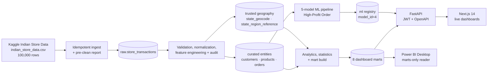
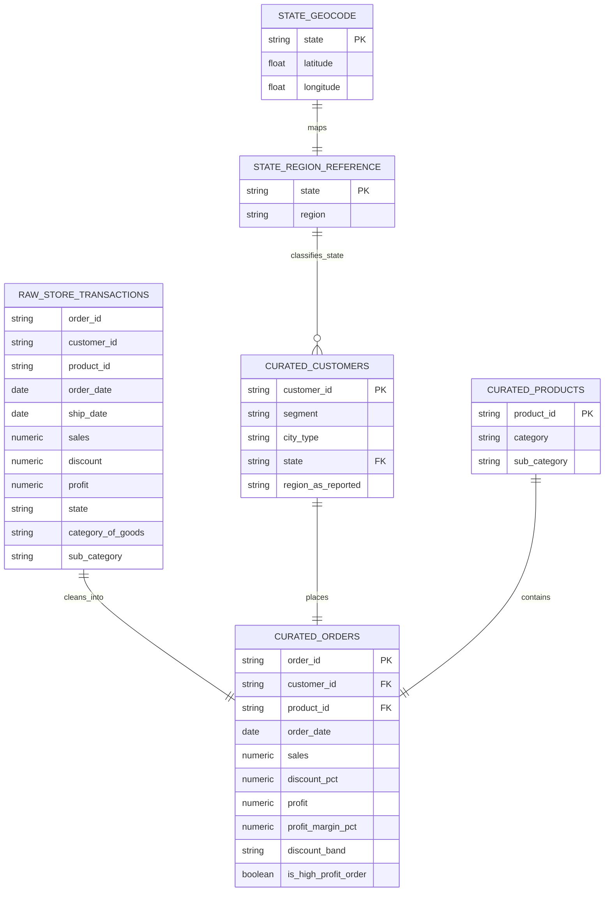

# Retail IQ Architecture

Retail IQ is an analytics-first, batch-oriented decision-support platform for
the Indian Store Data source. One flat CSV is preserved at source grain, cleaned
into a small relational core, transformed into purpose-built marts, and served
to both the web application and Power BI.

## System flow

The web client never queries PostgreSQL directly. It uses the generated
OpenAPI client and keeps its access token in memory. FastAPI validates filters,
routes requests to compatible mart grains, and serves registered-model
inference. Power BI is a separate read-only consumer of those same marts, which
keeps KPI definitions consistent across both presentation layers.

## Current data model

The migrated source has exactly one row per order, customer, and product. An
`order_items` table would add no information, so the curated model deliberately
keeps the transaction on `orders`.

`region_as_reported` is retained only for auditability: all 10 represented
states appear under all four reported regions, so it is not real geography.
Every geographic mart, API, map, and statistical grouping instead uses the
cited `state_region_reference` mapping.

Platform tables (`users`, `refresh_tokens`, `admin_settings`, and
`data_refresh_log`) remain in `curated` because they support application
operation rather than retail analysis.

## Mart topology

| Mart | Grain | Primary consumer |
|---|---|---|
| `kpi_snapshot` | singleton | Executive KPI cards |
| `revenue_daily` | date | Revenue/profit trends |
| `revenue_by_category` | date × category × sub-category | Product dashboard |
| `revenue_by_region` | date × state × trusted region × city type | Regional map/dashboard |
| `shipping_performance` | date × ship mode × trusted region | Descriptive shipping view |
| `customer_profile` | customer | Cross-sectional customer view |
| `customer_segments` | segment × order-value tier × city type | Segment comparison |
| `category_discount_profit` | category × sub-category × discount band | Discount/profit analysis |

Aggregate marts are never joined fact-to-fact. Requests select the narrowest
compatible mart under [`mart-routing.md`](mart-routing.md), preventing row
multiplication and preserving the performance benefit of pre-aggregation.

## Batch and request flows

1. `make etl` loads the single CSV idempotently, writes the pre-clean report,
   validates and normalizes fields, preserves legitimate outliers as flags, and
   writes the post-clean report.
2. `make analytics-reports` atomically rebuilds the eight marts and regenerates
   EDA/statistical artifacts.
3. `make train` applies the fixed 10-feature contract, compares five algorithms
   on the same stratified 80/20 split, and registers the selected Gradient
   Boosting model.
4. Authenticated requests carry server-side filters to FastAPI; React Query
   caches returned data while the responsive frontend renders charts, tables,
   the geographic choropleth, recommendations, and model output.

## Trust boundaries

- Secrets are supplied through ignored `.env` files; examples contain only
  placeholders.
- Passwords are hashed, refresh tokens are stored hashed, and access tokens are
  kept in frontend memory rather than browser storage.
- SQL inputs are parameterized and every business route requires JWT auth.
- `powerbi_reader` has `USAGE` and `SELECT` only on `marts`; it has no access to
  `raw`, `curated`, or `ml`.
- Raw data and generated model artifacts are not committed.

## Deployment topology and path to production

Docker Compose is the reference deployment: PostgreSQL 15 persists in a named
volume, the backend waits for database health and applies Alembic migrations,
and the frontend waits for backend health. GitHub Actions independently checks
backend quality/tests, frontend lint/type/unit/e2e/build, and both Docker images.

A production deployment would use managed PostgreSQL, private networking,
container hosting such as Azure Container Apps or AWS ECS, a managed secrets
store, TLS termination, CDN-served frontend assets, central logs/metrics,
backups, and scheduled orchestration. Those are documented future scope, not
claims about the local academic reference build.
