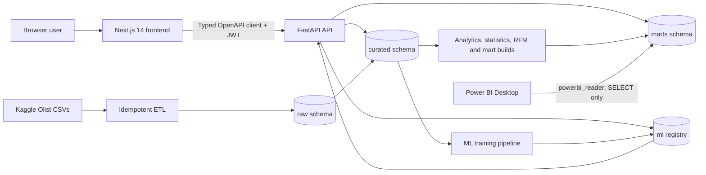

# Retail IQ Architecture

This document finalizes the SRS §6.1 architecture implemented by Retail IQ.

The browser uses a responsive Next.js application and an OpenAPI-generated,
type-safe client. FastAPI owns authentication, validation, mart routing,
analytics, deterministic recommendations, and model inference. PostgreSQL 15
separates source-shaped ingestion (`raw`), cleaned entities (`curated`),
dashboard aggregates (`marts`), and model governance (`ml`). Power BI is an
additional read-only consumer of marts; it cannot access source, curated, or
model-registry data.

## Request flow

1. The administrator signs in; FastAPI returns an in-memory access token and
   sets the rotating refresh token as an httpOnly, Secure, SameSite=Strict
   cookie.
2. The frontend sends validated shared filters with a bearer token.
3. The router selects the narrowest compatible mart according to
   [`mart-routing.md`](mart-routing.md), executes parameterized SQL, and returns
   the standard timestamped envelope.
4. React Query caches the response and the dashboard renders accessible charts,
   tables, maps, metrics, or model results.

## Batch flow

1. Nine Olist CSVs are loaded idempotently into loose-typed raw tables.
2. Cleaning validates required values and relationships, removes invalid rows,
   preserves legitimate outliers with flags, and creates pre/post quality
   reports.
3. Analytics builds the final marts at their governed grains: date;
   date×category; date×state×city; date×seller; date×payment type; plus customer,
   review, and delivery marts.
4. The ML job builds leakage-safe order features, applies the group-aware split,
   compares five algorithms, stores the winning joblib artifact, and registers
   its metrics and feature importance.

## Deployment topology

Docker Compose is the reference deployment: `db` uses a named volume,
`backend` waits for PostgreSQL and applies Alembic migrations, and `frontend`
waits for the API health check. The host exposes ports 5432, 8000, and 3000.
GitHub Actions independently verifies backend quality/tests, frontend
lint/type/build/unit/e2e, and both Docker images.

## Trust boundaries

- Secrets remain in ignored `.env` files; examples contain placeholders only.
- Application users are stored in `curated.users`; refresh tokens are hashed.
- `powerbi_reader` has `USAGE`/`SELECT` only on `marts` and explicit denial on
  `raw`, `curated`, and `ml`.
- Raw datasets, model artifacts, and local credentials are not committed.

## Path to production

The implemented v1 deployment is local Docker Compose. A cloud deployment would
replace local PostgreSQL with managed PostgreSQL, run containers on Azure
Container Apps or AWS ECS, place secrets in a managed secret store, terminate
TLS at a load balancer, serve frontend assets through a CDN, add centralized
logs/metrics, backups, and private database networking. These are future scope,
not claims about the current build.
