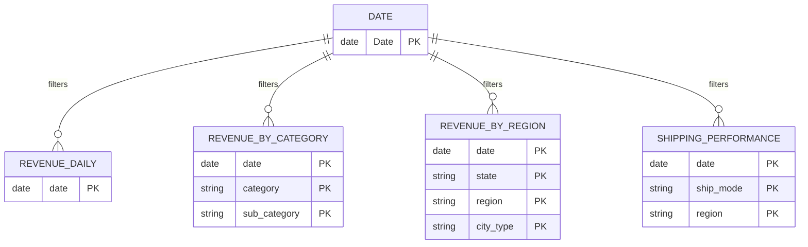

# Power BI Integration

Power BI Desktop connects directly to the finalized Indian Store Data marts
through the least-privilege `powerbi_reader` PostgreSQL login. No Microsoft,
Power BI Service, Azure AD, or cloud credential is required for this local
Desktop workflow.

## 15–20 minute Desktop build

There is no checked-in `.pbix`. This execution environment can access the
repository and terminal but cannot control or verify the user's live Power BI
Desktop session, and no `pbi-tools`, Tabular Editor, or XMLA endpoint is
available. A renamed archive or other unverified binary would not be a valid
deliverable. The shortest reproducible manual path is:

1. **Connect (2–3 minutes):** use the settings below and import
   `marts.revenue_daily`, `marts.revenue_by_category`,
   `marts.revenue_by_region`, `marts.shipping_performance`,
   `marts.customer_segments`, `marts.category_discount_profit`, and
   `marts.kpi_snapshot`.
2. **Model (3–4 minutes):** paste the `Date` expression from
   `powerbi/RetailIQ-Measures.dax`, mark it as the date table, and create the
   four single-direction relationships shown below.
3. **Measures (3–4 minutes):** copy the complete DAX file into Power BI, one
   measure at a time. No names or formulas need translating.
4. **Visuals (5–7 minutes):** add Revenue/Profit/Profit Margin/AOV/Avg Discount
   cards, a Date-axis revenue line, category bars, and the state map.
5. **Reconcile (1 minute):** confirm the Revenue and Profit cards equal the
   exact values in the reconciliation table below.

## Connection

1. Set a strong, unique `POWERBI_READER_PASSWORD` in `backend/.env` before the
   first migration run. Never commit the value.
2. Complete the README setup through `make analytics-reports`.
3. In Power BI Desktop, select **Get data → PostgreSQL database**.
4. Use these values:

| Setting | Local value |
|---|---|
| Server | `localhost:5432` |
| Database | `retail_bi` |
| Data connectivity mode | `Import` |
| Authentication | Database |
| User name | `powerbi_reader` |
| Password | the value set in `backend/.env` |

Import mode is recommended because this is a bounded, batch-refreshed dataset
and the marts are already pre-aggregated. DirectQuery is supported by the same
database boundary, but adds avoidable latency and requires the local stack to
remain online while a report is viewed.

## Tables and grains

Import only the tables needed by a report page.

| Mart | Physical grain | Intended use |
|---|---|---|
| `kpi_snapshot` | one all-period row | KPI reconciliation/reference |
| `revenue_daily` | `date` | Revenue, profit, AOV, discount, trends |
| `revenue_by_category` | `date × category × sub_category` | Category and sub-category analysis |
| `revenue_by_region` | `date × state × region × city_type` | Geographic and city-type analysis |
| `shipping_performance` | `date × ship_mode × region` | Descriptive shipping duration only |
| `customer_profile` | `customer_id` | Cross-sectional order-value profiles |
| `customer_segments` | `segment × order_value_tier × city_type` | Segment comparisons |
| `category_discount_profit` | `category × sub_category × discount_band` | Discount-versus-profit analysis |

`region` in the marts is derived from `curated.state_region_reference`. The
unreliable source-reported region is deliberately excluded from Power BI.

## Relationship model

Create the `Date` table from
[`RetailIQ-Measures.dax`](../powerbi/RetailIQ-Measures.dax), mark it as the date
table, and use single-direction one-to-many date relationships:



Keep `kpi_snapshot`, `customer_profile`, `customer_segments`, and
`category_discount_profit` disconnected unless a report adds explicit dimension
tables. Never relate aggregate marts directly to one another: fact-to-fact joins
would multiply rows and corrupt totals.

## Governed measures

Copy the complete library from
[`powerbi/RetailIQ-Measures.dax`](../powerbi/RetailIQ-Measures.dax). Its base
measures translate the migration metric dictionary directly:

- Revenue = source `SUM(sales)`, materialized as
  `SUM(revenue_daily[revenue])`.
- Profit = source `SUM(profit)`, materialized as
  `SUM(revenue_daily[total_profit])`.
- Profit Margin = Profit ÷ Revenue.
- AOV = Revenue ÷ distinct order count; one source row equals one order.
- Average Discount = the order-count-weighted average of daily
  `avg_discount_pct`, exactly reproducing source `AVG(discount_pct)`.

Use INR formatting with the `en-IN` locale. Profit Margin and Average Discount
are percentages. The library also provides separate category and regional
measures so a page does not accidentally combine incompatible mart grains.

Paste-ready core measures (identical to the library):

```DAX
Revenue = SUM ( revenue_daily[revenue] )

Profit = SUM ( revenue_daily[total_profit] )

Profit Margin = DIVIDE ( [Profit], [Revenue] )

Total Orders = SUM ( revenue_daily[order_count] )

AOV = DIVIDE ( [Revenue], [Total Orders] )

Avg Discount =
DIVIDE (
    SUMX (
        revenue_daily,
        revenue_daily[avg_discount_pct] * revenue_daily[order_count]
    ),
    [Total Orders]
)
```

## Exact reconciliation

The final M9 verification compares the same populated database used by the web
dashboard with the Power BI DAX sources:

| KPI | Live dashboard / `kpi_snapshot` | Power BI source calculation | Result |
|---|---:|---:|---|
| Revenue | **₹2,50,84,41,014.18** | `SUM(revenue_daily[revenue])` = **₹2,50,84,41,014.18** | Exact |
| Profit | **₹37,55,30,511.43** | `SUM(revenue_daily[total_profit])` = **₹37,55,30,511.43** | Exact |

Re-run the proof after any data refresh:

```sql
SELECT total_revenue, total_profit
FROM marts.kpi_snapshot
WHERE snapshot_id = 1;

SELECT SUM(revenue) AS revenue, SUM(total_profit) AS profit
FROM marts.revenue_daily;
```

The two rows must match to the rupee (and currently match to the paise). A
different result is a model/filtering error and must not be hidden by rounding.

## Data quality and preprocessing page

To show migration work in the Power BI report, add a **Data Quality & Pipeline**
page using these generated evidence artifacts:

- [`data_quality_report_pre_clean.md`](../analytics/reports/data_quality_report_pre_clean.md)
- [`data_quality_report_post_clean.md`](../analytics/reports/data_quality_report_post_clean.md)
- [`eda_report.md`](../analytics/reports/eda_report.md)
- [`statistical_analysis_report.md`](../analytics/reports/statistical_analysis_report.md)
- [`model_comparison_v2.md`](../analytics/reports/model_comparison_v2.md)

Show the 100,000 raw-to-curated row reconciliation, discount normalization,
retained profit-outlier count, unreliable source-region finding, engineered
profit margin/discount bands, and model evaluation. These are generated
evidence, not editable substitutes for database facts. `powerbi_reader` remains
marts-only; access is not widened merely to visualize pipeline provenance.

## Refresh and access boundary

Run `make etl`, `make analytics-reports`, and `make train` before selecting
**Refresh** in Power BI Desktop. The role may `SELECT` from `marts` and cannot
use or read `raw`, `curated`, or `ml`. The repository intentionally provides a
reproducible relationship guide and DAX library rather than a fabricated binary
`.pbix`; authoring or publishing a Power BI report remains a local Desktop/UI
operation and requires no credential to be shared with Codex.
